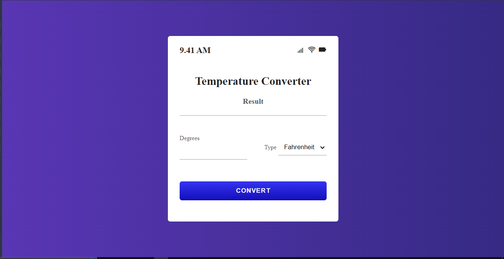

# Temprature Converter:

## Features:
This temperature converter has the ability to:
- convert temperature given in Fahrenheit to Celcius
- convert temperature given in Kelvin to Celcius
- use can increase value by pressing top and botton increasing and decreasing buttons
- It will show different details using icons like battery percentage, time etc.
- has a nice and beautiful interface

## Tech Stack:
This project is made by using HTML, CSS, JavaScript

## Outout
